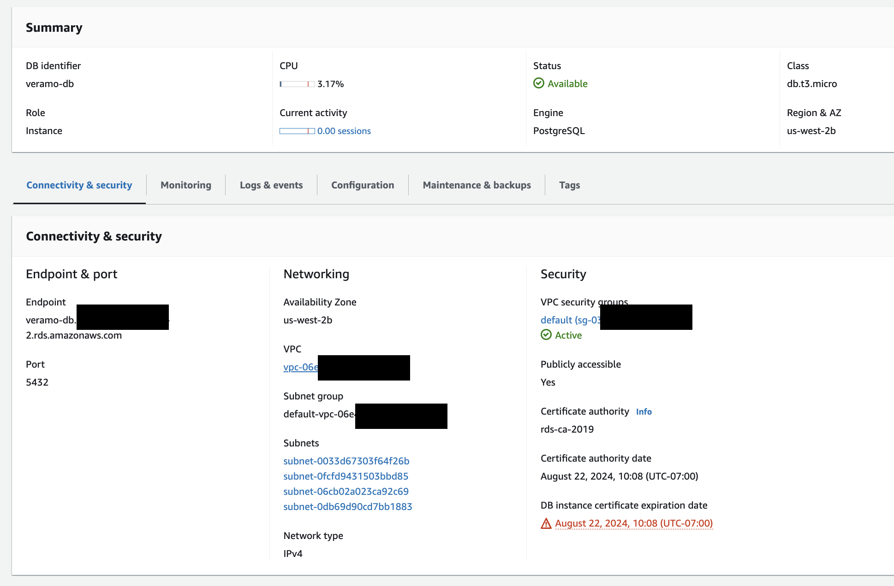
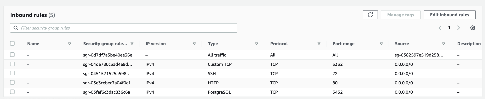
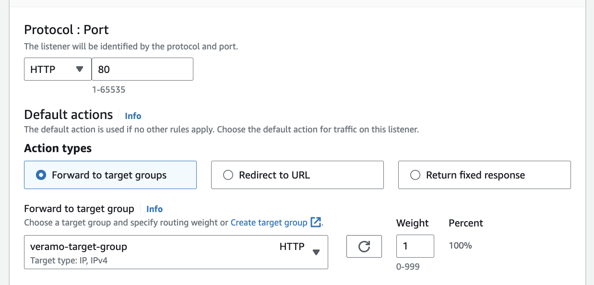
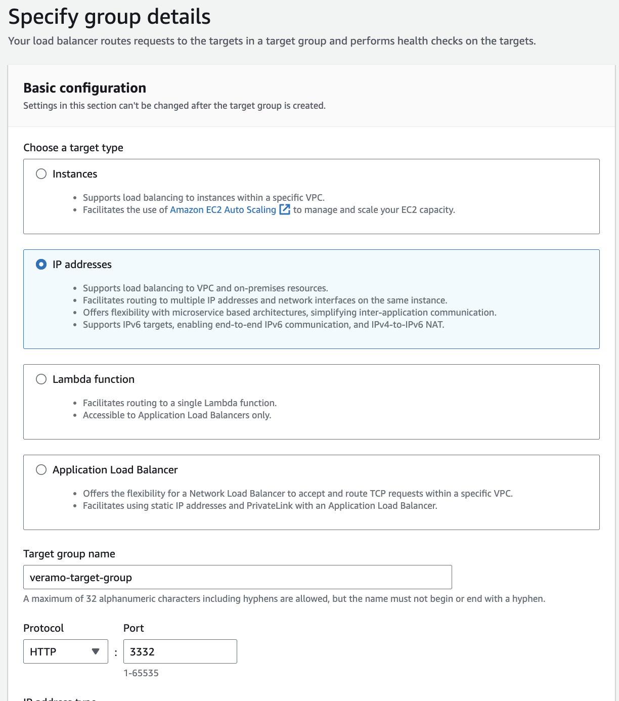
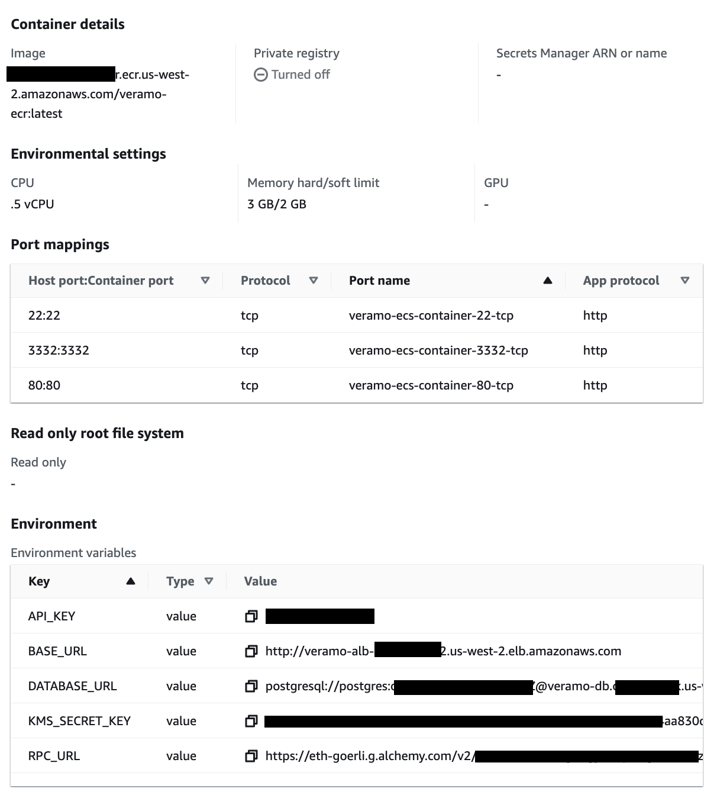

# Veramo Agent

## Environment variables

These are the default environment variables used by the agent. Check out `.env.sample` file for an example. If you want to run the agent locally, you can create a `.env` file and set the variables there.

#### `BASE_URL`

Set this to your base app url. Your default web:did will be based on this when it gets created on first run.

#### `API_KEY`

Used for authorization

#### `KMS_SECRET_KEY`

Used for encrypting the database. Can be created by cli i.e `veramo config gen-key`

#### `DATABASE_URL`

The database connection string for Postgres. If you are using a different database, you will need to change the `@veramo/data-store` package to the correct one.

#### `RPC_URL`

The RPC url for the Ethereum network you want to use.

## preparation

- Install dependencies

```
pnpm i
```

- Setup .env file
- Run postgre database with database name `veramo`

## Running locally

- Start the agent from ts-node

```
pnpm dev
```

## Running on Docker

- Setup DATABASE_URL in docker-compose.yml (if you are using host's local postgre database it should point to `host.docker.internal`)
- Build the image. It should build for linux/amd64 and for your local architecture(e.g. M1 or M2 Mac)

```
docker-compose build
```

- Start the agent

```
docker-compose up
```

- Stop the agent

```
docker-compose down
```

## Deploy to AWS

### Build & tag docker image

```
docker build --platform=linux/amd64 -t veramo-agent .
```

### Setup RDS

Setup PostgreSQL with the settings below:



- Port: 5432
- Public access: Yes (to check the )
- VPC: Should be same as ECS
- VPC security group: Should be same as ECS
  
- **Make sure to note the password for postgre user**

#### Setup SSL

- In order to access RDS from ECS, we need to setup SSL
- Download certificate bundle from https://docs.aws.amazon.com/AmazonRDS/latest/UserGuide/UsingWithRDS.SSL.html (e.g. us-west-2-bundle.pem)
- Copy the first CA certificate from the bundle to a new file (e.g. rds-ca-2019.pem). It should look like this:

```
-----BEGIN CERTIFICATE-----
...
-----END CERTIFICATE-----
```

- Put the file under `/ca` folder

### Setup ECR

- Create ECR repository on AWS

```
aws ecr create-repository --repository-name veramo-ecr --region us-west-2
```

- sign in to aws ECR

```
 aws ecr get-login-password --region {region} --profile={profile} | docker login --username AWS --password-stdin {accountId}.dkr.ecr.{region}.amazonaws.com
```

- Push image to ECR

```
docker tag veramo-agent:latest {accountId}.dkr.ecr.{region}.amazonaws.com/veramo-agent:latest
docker push {accountId}.dkr.ecr.{region}.amazonaws.com/veramo-ecr:latest
```

### Setup ALB

In order to access the agent from the internet with the static address, we need to setup Application Load Balancer

- Forward request to 80 to Target group
  
- Target group must set the routing to port 3332 and target type to IP
  

### Setup ECS(Fargate)

- Create ECS cluster
  - Go to https://us-west-2.console.aws.amazon.com/ecs/v2/clusters and `Create Cluster`
  - Use Fargate to let AWS manage the infrastructure
- Create ECS task definition
  - Go to https://us-west-2.console.aws.amazon.com/ecs/v2/task-definitions and `Create new Task Definition`
  - Set port and environment variables
    
- Create ECS service
  - Go to https://us-west-2.console.aws.amazon.com/ecs/v2/services and `Create`

## Testing

You can access using the client at https://github.com/tomoima525/veramo-client
